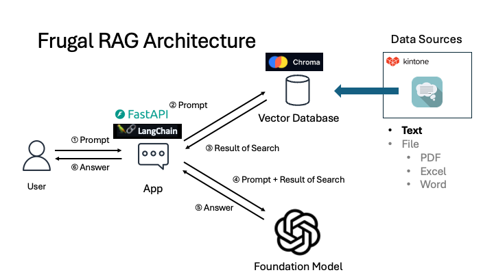
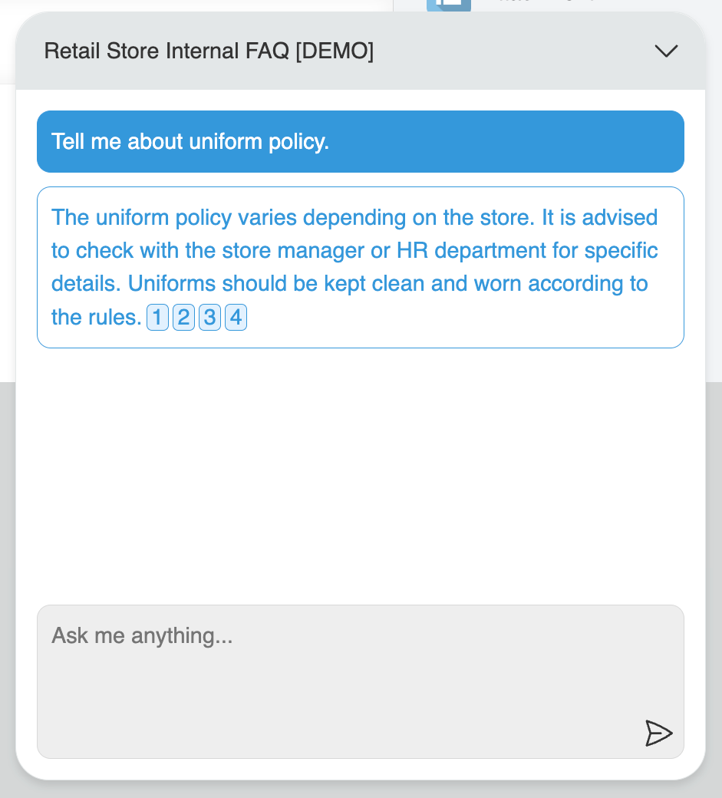

# Frugal RAG

This repository contains a retrieval augmented generation (RAG) application. The application provides a backend API for vector search and RAG, and a frontend Chat Box UI for interacting with the RAG system.

## Architecture



## Backend `./backend/`

The backend is built using Docker and provides the following components:

- **API Server**: `./backend/app/`
    - **Web Framework**: FastAPI
    - **AI Agent**: LangChain
    - **Vector Database**: Chroma DB
    - **AI Foundation Model**: OpenAI GPT3.5-turbo
- **Nginx**: `./backend/nginx/`
    - **Proxy Server**: Nginx is used as a proxy server.

### Configuration

#### Environment Variables `./backend/.env`
Specify your environment variables in an .env file in the backend directory. Example .env file:

```
KINTONE_APP_API_TOKEN={your kintone app API token}
OPENAI_API_KEY={your OpenAI API key}
```

#### Other Settings `./backend/app/config/`
Other settings are configured in `./backend/app/config/`. These settings are stored in YAML files. If necessary, you can also edit `settings.py`.

```yaml
app_name: FastAPI App

datasources:
  kintone:
    base_url: https://sample.kintone.com
    apps:
      - id: 1042
        api_token: '** import from environment variables in settings.py **'
        fields:
          - Question
          - Answer

models:
  openai:
    model: gpt-3.5-turbo
    api_key: '** import from environment variables in settings.py **'

chromadb:
  collection_name: kintone-rag-app
  persist_dir: /tmp/chromadb
  cache_dir: /tmp
  embeddings_model_name: all-MiniLM-L6-v2

docs:
  url: /docs
  title: API Documentation

debug: True
log_level: INFO
```

## Getting Started with Docker-Compose `./backend/`

Here is an example of how to run the application using Docker Compose:

```sh
cd backend
docker componse up
```

# Frontend

The frontend is built using Kintone's global JavaScript customization feature and provides a Chat Box UI for interacting with the RAG system.

## Configuration `./frontend/src/ts/constants/index.ts`

You need to configure the API endpoint in `./frontend/src/ts/constants/index.ts`. The following is an example of how to configure the endpoint when running the application locally using Docker Compose:


```typescript
export const API_ENDPOINT = 'http://localhost:8000';
```

## How to build TypeScript Files `./frontend/`

Install the necessary libraries and build the frontend:


```sh
cd frontend
yarn install
yarn build
```

## Deployment
### Frontend

Deploy the frontend as a Kintone global JavaScript customization. This will install a Chat Box UI in your Kintone application.



### Backend

To deploy the API in a production environment, you'll need to set up a multi-container environment. Services like Amazon Lightsail or Google Cloud's Cloud Run offer easy deployment options.

## Notice
- When deploying the API to a production environment, it is recommended to add more security settings such as restricting access from specific IP addresses, as needed.
- The current configuration does not persist the database. Data needs to be retrieved every time the container restarts. If the amount of data handled increases, leading to longer processing times or API request issues, consider database persistence or differential updates.

## Feature Ideas

Here are some ideas for future features that could enhance the RAG system:

- **Logging:** Implementing logging can be beneficial for monitoring the performance of the RAG system and analyzing its usage. This can help identify areas for improvement and ensure optimal performance.

- **File Indexing:** Currently, the system indexes text data. Expanding the indexing capabilities to include files such as PDFs, Excel spreadsheets, and Word documents would significantly enhance the system's functionality. This would require careful consideration of API request limits and database persistence to ensure scalability and efficiency.

- **Multimodal Input:** Integrating multimodal input, such as voice and image recognition, could further enhance the user experience and make the RAG system more accessible. This would allow users to interact with the system in a more natural and intuitive way.
